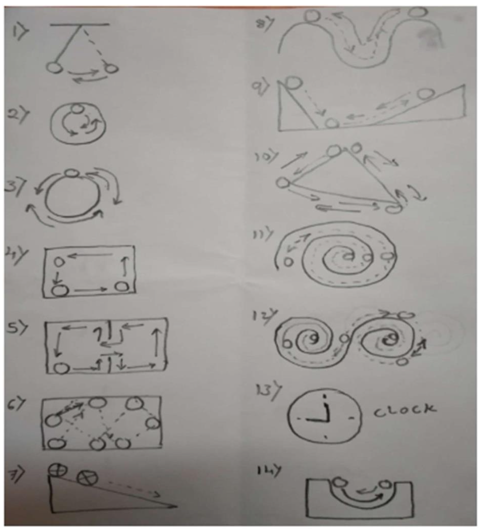

# Computer Graphics Programs

## Line Drawing Algorithms
1. DDA and Bresenham Line Drawing Algorithm
2. Bresenham and Midpoint Circle Drawing Algorithm

## Polygon Filling Algorithms
3. Flood Fill Algorithm for Convex Polygon
4. Boundary Fill Algorithm for Convex Polygon
5. Edge Fill Algorithm for Convex Polygon
6. Fence Fill Algorithm for Convex Polygon
7. Scan Line Fill Algorithm for Polygon (5 vertices)
8. Scan Line Fill Algorithm for Concave Polygon (5 vertices)

## 2D Transformations
9. Reflection about X-axis and Y-axis (4 quadrants)
10. Rotation about Origin and Fixed Point (4 quadrants)
11. Reflection about Origin and Line Y=X (4 quadrants)
12. X-shear and Y-shear Transformations
13. Combined Transformations (Scaling, Reflection, Translation)
14. Scaling and Translation (4 quadrants)
15. Scaling and Rotation (4 quadrants)
16. Translation and Rotation (4 quadrants)
17. Shearing and Rotation (4 quadrants)

## Clipping Algorithms
18. Sutherland Hodgeman Polygon Clipping Algorithm
19. Cohen Sutherland Line Clipping Algorithm
20. Midpoint Line Clipping Algorithm

## Curves and Fractals
21. Bezier Curve (4 points, Midpoint method, 4 iterations)
22. Koch Curve (3 iterations)
23. Fractal Line (10 iterations)

## Animation
24. Animation using Mid-point/Bresenham Circle and DDA/Bresenham Line Drawing Algorithms 
